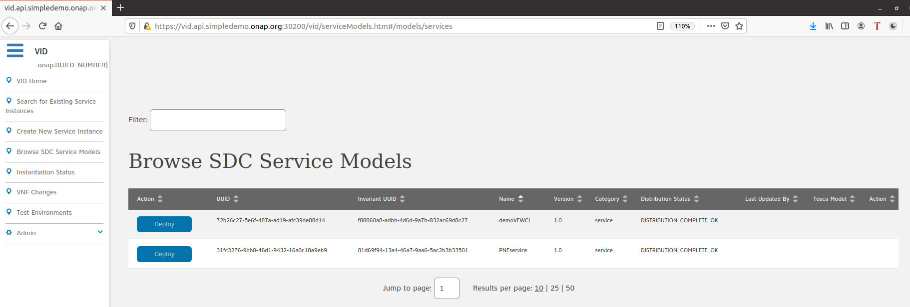
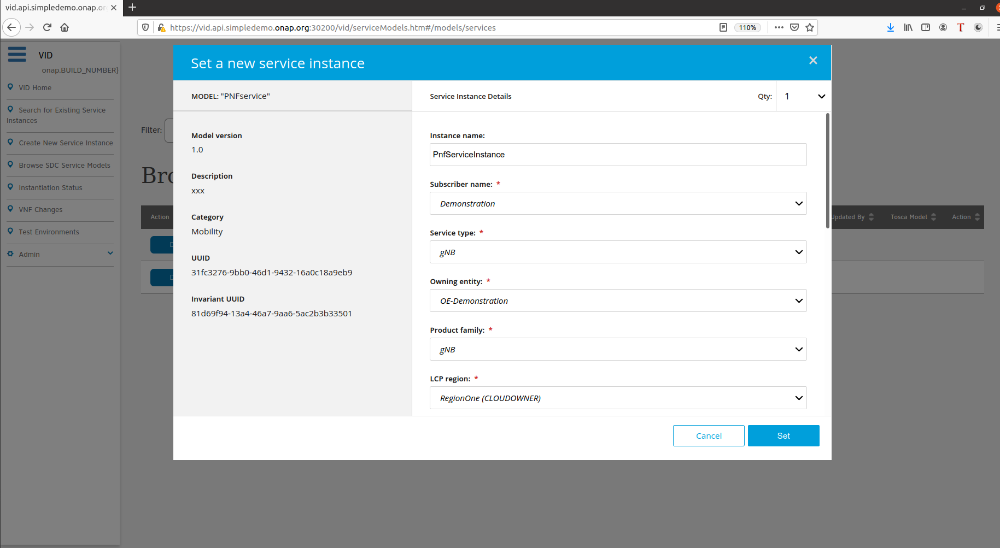
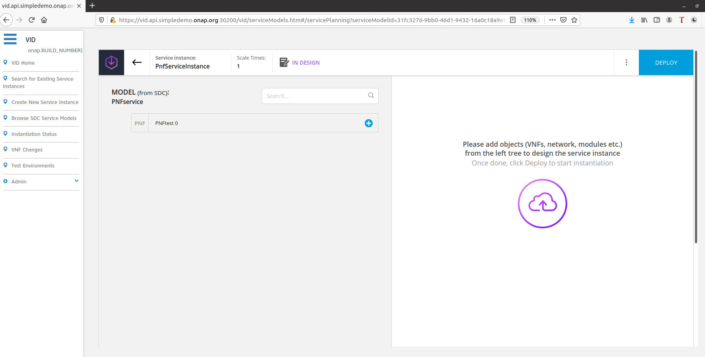
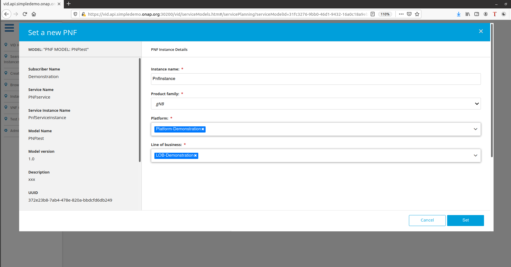
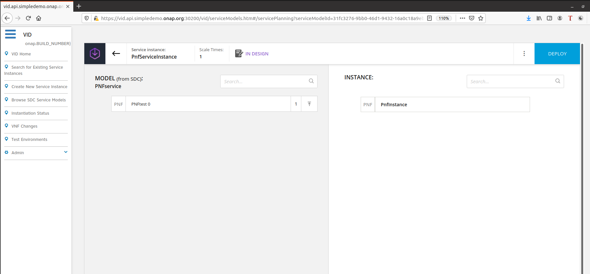
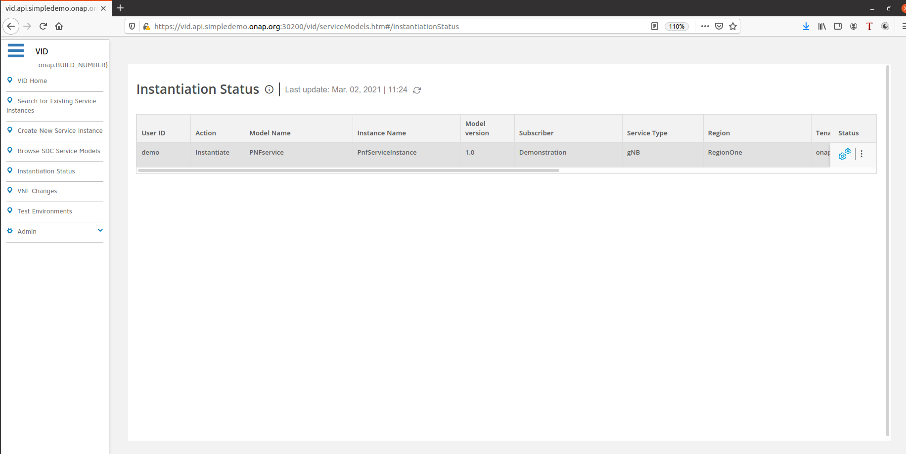
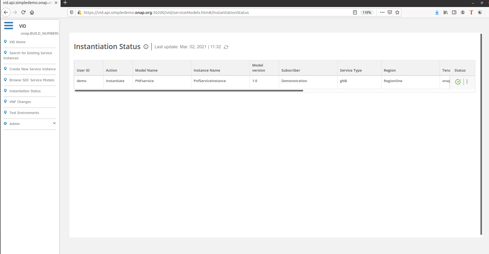
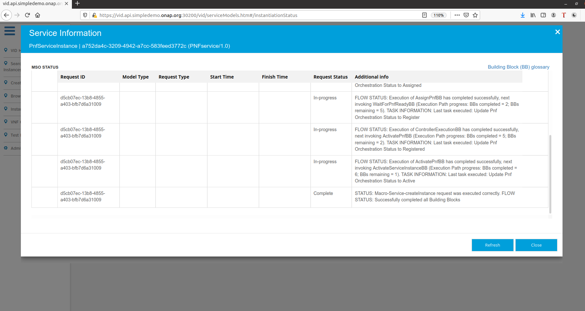

.. This work is licensed under a Creative Commons Attribution 4.0
International License.
.. http://creativecommons.org/licenses/by/4.0
.. _instantiatemacro:

Instantiate Service, "Macro" mode (PNF example)
================================================

Overview
--------

Using VID with Macro method means that all the service model resources are deployed in a single SO API call.
Macro orchestration model can be used to orchestrate service models, which contain PNFs and VNFs.

`Pre-requisites`_
--------------

.. note::
   To be able to orchestrate services in "Macro" mode, the VID ModernUI needs to be enabled.
   Review settings in VID container`s /usr/local/tomcat/webapps/vid/WEB-INF/conf/onap.features.properties file.
   Flags below must be set to "true":
    ...
    FLAG_ENABLE_WEBPACK_MODERN_UI = true
    FLAG_EXTENDED_MACRO_PNF_CONFIG = true
    ...

.. _Pre-requisites: https://docs.onap.org/projects/onap-vid/en/latest/instantiate.html#pre-requisites

`Access to VID portal`_
--------------------

.. _Access to VID portal: https://docs.onap.org/projects/onap-vid/en/latest/instantiate.html#access-to-vid-portal

Instantiate Service in "Macro" mode
-----------------------------------

A Service Model, which contains a PNF resource will be used to demonstrate the "Macro" orchestration mode.

Click "Browse SDC Service Models" and search for the service to instantiate.

The view show only service models in the DISTRIBUTED state.

Select a service and click Deploy.

Complete the mandatory fields indicated by the red star and click "Set".

Add a new object to the service instance.

.. note::
   The blue button for adding objects to the service instance appears when you hover over the object model.

Complete the mandatory fields indicated by the red star and click "Set".

.. note::
   The PNF instance name must be unique

To deploy the selected configuration, click "DEPLOY" button in the top right corner.

If the service instance with selected objects is deployed correctly, you will be redirected to the page where you can check the instantiation status.

.. note::
   In case of Service Models, which contain PNF resources, to complete the deployment of the service instance with PNF object, send a "pnfRegistration" event to VES.
   No additional actions are needed for VNFs/CNFs.

Instantiation Status
-----------------------------------

The "Instantiation Status" contains information about all deployed service instances.

To check detailed information, click the ellipsis on the right side of the selected service instance.

Deleting Service Instances previous orchestrated in "macro" model
-----------------------------------------

To delete a previously created "Macro" instance using VID, the entire service instance must be deleted.

To proceed with a service instance removal, from VID Home screen:

- search for existing service instance
- edit/view the service instance you want to delete
- click on red button with white cross
- confirm deletion of the service instance
