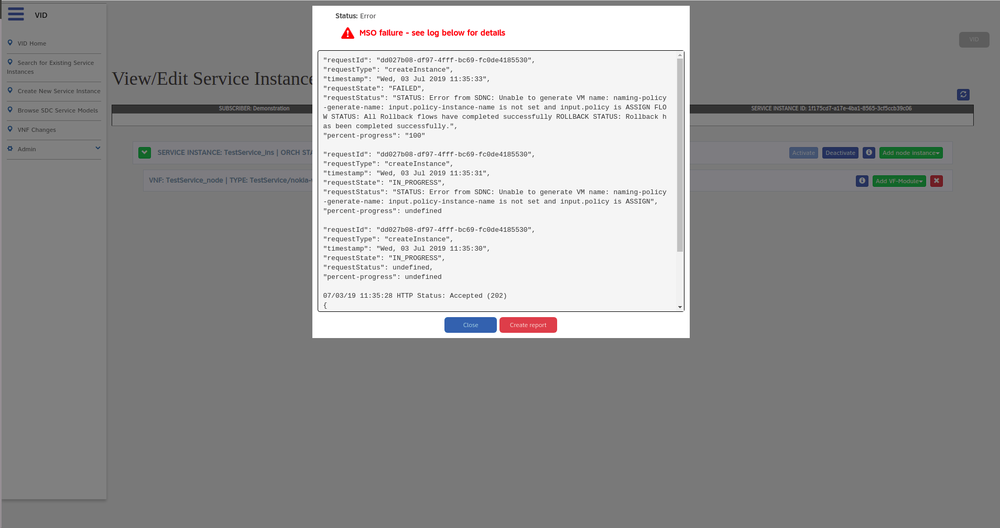
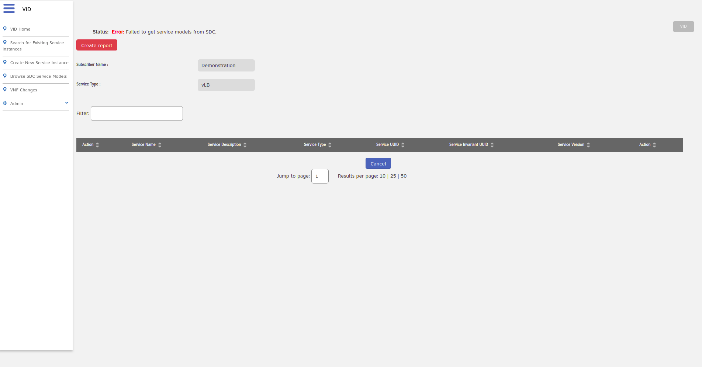
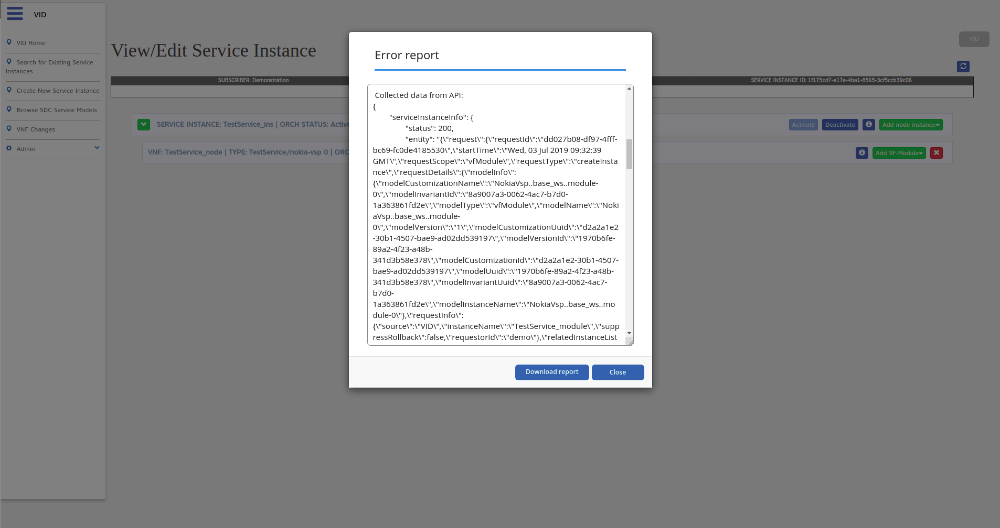

.. This work is licensed under a Creative Commons Attribution 4.0 International License.
.. http://creativecommons.org/licenses/by/4.0

Logging
=======

Where to Access Log Information
--------------------------------

+------------------------------------------------+---------------------+-------------------------------------------------------------------------------------------------------------------------------------------------------------------------------------------+
| Location                                       | Type                | Description                                                                                                                                                                               |
+================================================+=====================+===========================================================================================================================================================================================+
| /usr/local/tomcat/logs/catalina.YYYY-MM-DD.log | Jetty server log    | Tomcat server information                                                                                                                                                                 |
+------------------------------------------------+---------------------+-------------------------------------------------------------------------------------------------------------------------------------------------------------------------------------------+
| /opt/app/vid/logs/vid/audit.log                | Application audit   | An audit record is created in response to code transactions/operations taking place in VID. For instance "start logging".                                                                 |
+------------------------------------------------+---------------------+-------------------------------------------------------------------------------------------------------------------------------------------------------------------------------------------+
| /opt/app/vid/logs/vid/application.log          | Application logging | This log describes internal flows within VID.                                                                                                                                             |
+------------------------------------------------+---------------------+-------------------------------------------------------------------------------------------------------------------------------------------------------------------------------------------+
| /opt/app/vid/logs/vid/debug.log                | Application logging | Higher level logging can be enabled on demand by editing the logback.xml inside the server docker.                                                                                        |
|                                                |                     | The file is located under: WEB-INF/classes/logback.xml.                                                                                                                                   |
|                                                |                     | This log holds the application's debug and trace level output.                                                                                                                            |
+------------------------------------------------+---------------------+-------------------------------------------------------------------------------------------------------------------------------------------------------------------------------------------+
| /opt/app/vid/logs/vid/error.log                | Application logging | This log holds the application's exceptions info and error level output.                                                                                                                  |
+------------------------------------------------+---------------------+-------------------------------------------------------------------------------------------------------------------------------------------------------------------------------------------+
| /opt/app/vid/logs/vid/metrics.log              | Application logging | This log holds the metrics info on application's transactions.                                                                                                                            |
+------------------------------------------------+---------------------+-------------------------------------------------------------------------------------------------------------------------------------------------------------------------------------------+

How to create error report
--------------------------

In case of error appearance a red button with "Create report" on it, will show up.

Pressing that button will show window with data collected from GUI and fetched from API.

That data may be download by pressing "download" button.
**After closing the report window, data may not be available.**